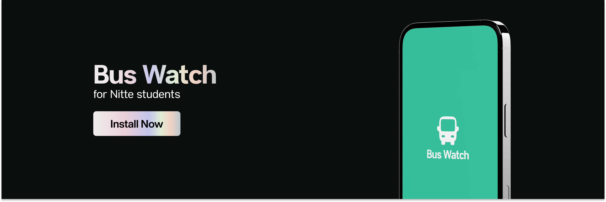

# Bus Watch for Nitte

## Introduction

Bus Watch is a mobile app built on top of React Native. Make it easy for students of Nitte and localities to find bus timings without needing to sign up or log in.

## Some notable goals of this app are

- **Feature 1:** :- Allow anyone to use the app without creating an account.
- **Feature 2:** :- Provide quick access to bus timings for a hassle-free experience.

## Currently only for Android!

## iOS users please be patient :)

## About Us

I'm a developer with a strong understanding of UI/UX principles and a passion for creating visually appealing and user-friendly user experiences for both mobile and web. I loves design and to code.

## Don't forget to star our repository!
